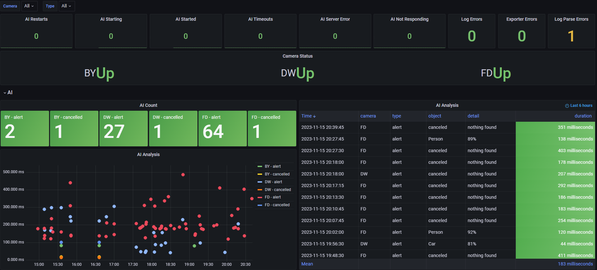

# blueiris_exporter
Prometheus exporter for Blue Iris.
Confirmed working on Blue Iris version's 5.5.0.12 to 5.9.2.2

>**Attention: blueiris_exporter is currently not combitible with Blue Iris version >=6. There is currently no ETA on when/if support will be added.**

If you increment `parse_errors` metrics, please send me the details and I will work on adding support for it. Blue Iris has changed it's log format for AI a few times and I'm working on adding support for all of it. Also, if you have any ideas for different metrics, let me know! 

## Todo
Tests

## Flags

Flag     | Description | Default value | Required
-|-|-|-
`--telemetry.addr` | addresses on which to expose metrics | `:2112` | No
`--logpath` | Directory path to the Blue Iris Logs | `C:\BlueIris\log\` | No
`--telemetry.path` | URL path for surfacing collected metrics | `/metrics` | No
`--service.install` | Install blueiris_exporter as a Windows service | None | No
`--service.uninstall` | Uninstall blueiris_exporter Windows service | None | No
`--service.start` | Start blueris_exporter Windows service | None | No
`--service.stop` | Stop blueris_exporter Windows service | None | No
`--service.pause` | Pause blueris_exporter Windows service | None | No
`--service.continue` | Continue blueris_exporter Windows service | None | No

## Installation and Usage
`blueiris_exporter` listens on HTTP port 2112 by default. See the `--help` output for more options.

You need to make sure that Blue Iris is saving the log to a file. 
1. Click the Status Button at the top left of Blue Iris
2. Select the `Log` tab
3. Check the box `Save to file`

By Default, Blue Iris will break out your log files by month. This means the counter metrics will reset at the beginning of each month. If you don't want this to happen, concider changing the name of your log files. 


## Windows

The latest release can be downloaded from the [releases page](https://github.com/wymangr/blueiris_exporter/releases). Save `blueiris_exporter-amd64.exe` to a safe place, it will be required to stay on your system to use blueiris_exporter.

Open a command prompt and change directory to the directory you saved the executiable.

To run the exporter (example):
```
blueiris_exporter-amd64.exe --logpath=C:\BlueIris\log
```

You can also run blueiris_exporter as a Windows service in the background.
Open command prompt as `Administrator` (Start ->CMD->right click->Run as administrator) and change directory to the directory you saved the executiable.
`IMPORTANT`: You may need to run the exporter once via command line shown above. A firewall allow window will pop up that you must click allow!
```
blueiris_exporter-amd64.exe --service.install --logpath=C:\BlueIris\log --telemetry.addr=:1234
blueiris_exporter-amd64.exe --service.start
```

If you need to update the config for the service, (Update path of the log dir etc) You can do so by uninstalling the service and installing with the new config

```
blueiris_exporter-amd64.exe --service.stop
blueiris_exporter-amd64.exe --service.uninstall
blueiris_exporter-amd64.exe --service.install --logpath=C:\BI\log --telemetry.addr=:5678
blueiris_exporter-amd64.exe --service.start
```

### RHEL/CentOS/Fedora

Download the latest release from the [releases page](https://github.com/wymangr/blueiris_exporter/releases)

```
wget -O /usr/bin/blueiris_exporter https://github.com/wymangr/blueiris_exporter/releases/download/<release>/blueiris_exporter-amd64-linux
chmod +x /usr/bin/blueiris_exporter
blueiris_exporter --camers=C1,C2,C3 --logpath=/mnt/blueiris/logs
```

To install as a systemd service, edit and create `/etc/systemd/system/blueiris_exporter.service` with the following content:
```
[Unit]
Description=Blue Iris Exporter
After=multi-user.target
Conflicts=getty@tty1.service

[Service]
Type=simple
ExecStart=/usr/bin/blueiris_exporter --logpath=/blue_iris/log --telemetry.addr=:9876
StandardInput=tty-force
StandardOutput=syslog
StandardError=syslog
SyslogIdentifier=blueiris_exporter
Restart=always
RestartSec=5s

[Install]
WantedBy=multi-user.target
```

Then run `systemctl start blueiris_exporter`

### Docker

The Docker image is not hosted yet on Docker Hub, so you will need to build the image.

```
docker build -t <image_name>:<tag> .
```
You can then start up the container, passing in the Blue Iris log directory.
```bash
docker run -d \
  -p 2112:2112 \
  -v "/path/to/blueiris/log:/path/to/blueiris/log" \
  <image_name>:<tag> \
  --logpath=/path/to/blueiris/log
```

For Docker compose, see example below.

```yaml
---
version: '3.8'
services:

  blueiris_exporter:
    restart: unless-stopped
    build:
      context: .
      dockerfile: Dockerfile
    command: ["--logpath=/path/to/blueiris/log"]
    ports:
      - 2112:2112
    volumes:
      - /path/to/blueiris/log:/path/to/blueiris/log

```

## Metrics

Name     | Description |
---------|-------------|
ai_duration | Duration (ms) of the last Blue Iris alert for each camera. This metric will continue to expose the last duration each time it's scraped
ai_duration_distinct | Duration (ms) of the last Blue Iris alert for each camera. This metric will only show new alerts and will disapear the next scrpe
ai_count | Count of the number of times IA analyzed and image
ai_restarted | Number of times Blue Iris restarted the AI in the current logfile
ai_timeout | Number of AI timeouts in the current logfile
ai_servererror | Count of Deepstack server not responding errors in the current logfile
ai_notresponding | Count of AI not responding errors in the current logfile
ai_starting | Count of AI is being started log lines
ai_started | Count of AI has been started log lines
logerror | Count of unique errors in the current logfile
logerror_total | Count of total errors in the logs
camera_status | Status of each camera. 0=up, 1=down
triggers | Count of camera triggers
push_notifications | Count of push notifications sent
logwarning | Count of unique warnings in the current logfile
logwarning_total | Count all warnings in the current logfile
folder_disk_free | Free space of the disk the folder is using in bytes
folder_used | Size percentage of the limit a folder is using
hours_used | Hour percentage of the limit a folder is using
parse_errors | Lines in the Blue Iris log that this exporter was unable to parse. Open an issue to add support
parse_errors_total | Total number of lines in the Blue Iris log that this exporter was unable to parse
profile | Count of activation of profiles
ai_error | Count of AI error log lines


## Grafana Dashboard
https://grafana.com/grafana/dashboards/17432-blueiris/
